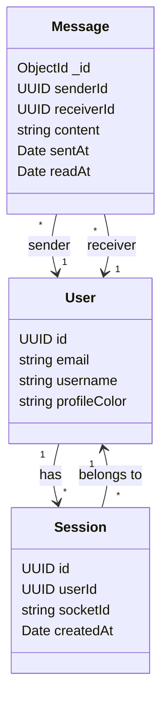

# Schéma UML - Application de Chat (NestJS + WebSocket)

```mermaid
classDiagram
    class User {
        UUID id
        string email
        string username
        string profileColor
    }

    class Session {
        UUID id
        UUID userId
        string socketId
        Date createdAt
    }

    class Message {
        ObjectId _id
        UUID senderId
        UUID receiverId
        string content
        Date sentAt
        Date readAt
    }

    %% Relations
    User "1" --> "*" Session : has
    Session "*" --> "1" User : belongs to

    Message "*" --> "1" User : sender
    Message "*" --> "1" User : receiver
```
